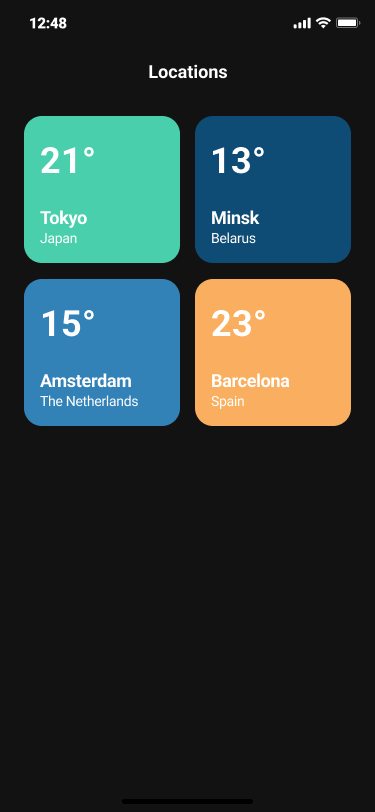
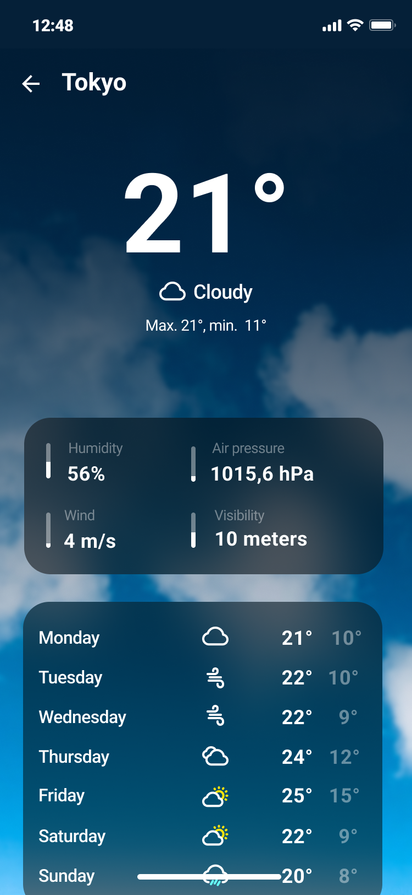

# Weather App - Android Developer Home Assignment

## Requirements

### 1. Cities Screen
- Display at least 4 cities statically in a grid layout
- Each city should show:
  - Current temperature
  - City name
  - Country/Region name
- Use colorful card-based design similar to the provided screenshot
- **Note:** We are not expecting a pixel-perfect design - visual similarity is sufficient

### 2. Weather Detail Screen
- Display detailed weather information for the selected city:
  - Large temperature display
  - Weather condition description
  - Additional weather metrics (humidity, air pressure, wind speed, visibility)
  - Weekly forecast (7 days)
- **Dynamic Background:** Background image should change based on current weather conditions
- **Weather Icons:** Use provided weather icons for current conditions and weekly forecast
- Navigation back to cities screen

### 3. Technical Requirements

#### API Integration
- Use **OpenWeatherMap API** (or any other weather API of your choice)

#### Testing
- **Unit Tests:** Must
- **UI Automation Tests:** Good to have

## Design Reference

The application should be visually similar to the provided screenshots:

### Cities Screen Reference

*Grid layout with colorful cards showing temperature and location information*

### Detail Screen Reference

*Detailed weather view with dynamic background and weekly forecast*

**Important:** We are not looking for a pixel-perfect implementation. Focus on creating a similar visual experience while demonstrating your Android development skills.

## Deliverables

1. Complete Android application source code
2. Unit tests with good coverage
3. UI automation tests (preferred)

## Resources Provided

- Weather condition background images
- Weather icons for current conditions and forecasts
- Design reference screenshots
